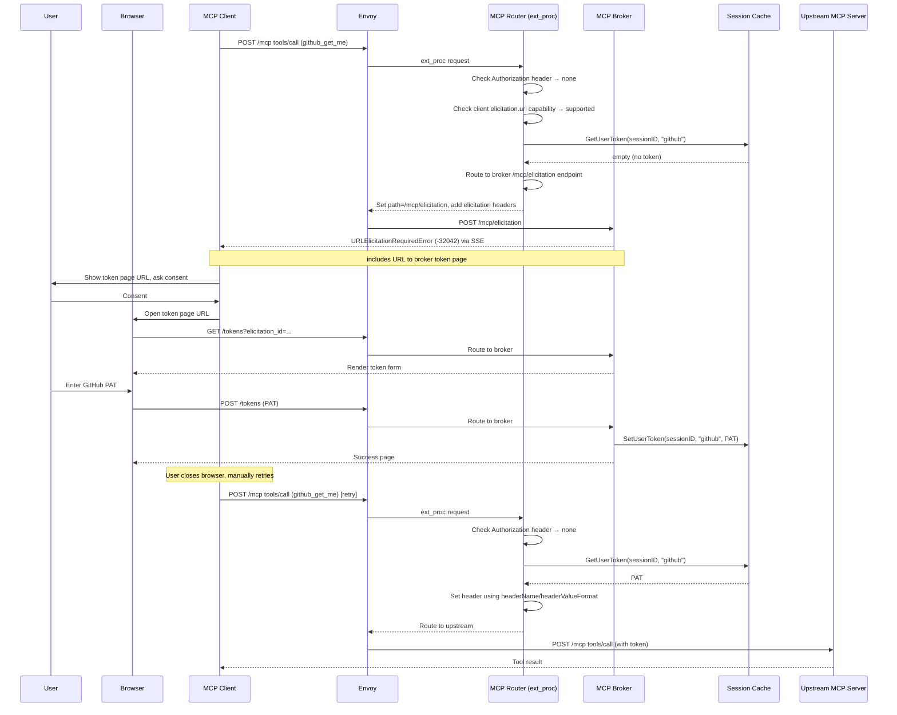
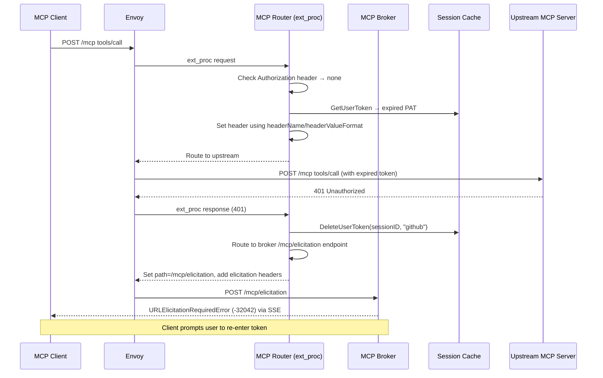

# Gateway-Initiated URL Elicitation for Per-User Tokens

## Problem

Many upstream MCP servers require per-user tokens. Example: a user's own GitHub PAT, not a shared service account token. The gateway currently supports several per-user token strategies:

1. **Header-based token replacement** — the MCP client sends the user's token in a custom header and the gateway maps it to the upstream `Authorization` header. The token passes through the MCP client, making it visible to the LLM context and client-side logging. The MCP specification explicitly [prohibits token passthrough](https://modelcontextprotocol.io/specification/2025-11-25/basic/security_best_practices#token-passthrough) for this reason.
2. **Token exchange via OAuth provider** — requires the OAuth provider to support token exchange and be configured per upstream. Requires third-party identity federation.
3. **Vault integration** — requires a Vault instance exposed to external users for token provisioning.

URL elicitation complements these strategies by offering a server-side token collection path that doesn't require exposing infrastructure like Vault to external users and keeps tokens out of the MCP client context and LLM context entirely.

## Summary

Enable the MCP Gateway to dynamically request per-user tokens at client tool-call/backend MCP call time if required using [URL mode elicitation](https://modelcontextprotocol.io/specification/2025-11-25/client/elicitation). The router detects a missing token and routes the request to the broker's `/mcp/elicitation` endpoint, which returns a `URLElicitationRequiredError`. The client directs the user to a broker-hosted token page. The token is cached per session and re-elicited on upstream 401.

## Goals

- Per-user token acquisition without exposing tokens to the client or LLM
- Protocol compliant as per [URLElicitationRequiredError flow](https://modelcontextprotocol.io/specification/2025-11-25/client/elicitation#url-mode-with-elicitation-required-error-flow) from the MCP specification
- Cache tokens encrypted in the shared session cache (Redis / in-memory)
- Invalidate cached tokens on upstream 401 to trigger re-elicitation
- Maintain capability of using OIDC authentication on the main broker gateway route

## Non-Goals

- Replace `credentialRef` (still used by the broker for tool discovery)
- Replace the value of AuthPolicy use with the Gateway
- Form mode elicitation for tokens (prohibited by the MCP spec for sensitive data)
- Full OAuth client in the broker

## Job Stories

### When I need per-user upstream tokens without exposing them to the LLM

When a platform engineer registers an upstream MCP server that requires per-user tokens (e.g., GitHub PATs), they want the gateway to securely collect tokens at runtime so that tokens never pass through the MCP client or appear in LLM context.

### When a user calls a tool that requires a token they haven't provided yet

When an MCP client user calls a tool on an elicitation-configured server and no token is cached for their session, they want to be directed to a browser-based page where the gateway can securely collect their token, so that the tool call succeeds on retry without any client-side configuration.

### When a cached token expires or is revoked

When an upstream server rejects a cached token with a 401, the user wants the gateway to automatically clear the stale token and prompt them to provide a new one, so that they can recover without restarting their session.

### When I have existing token infrastructure

When a platform engineer already has token infrastructure (e.g., Vault), they want to point the elicitation URL at their own UI instead of the broker's built-in page, so that tokens are stored in their existing system and an AuthPolicy handles injection.

### When a non-interactive agent calls a tool on an elicitation-configured server

When a CI/CD pipeline or automated agent calls a tool on a server that requires per-user tokens, but the agent cannot complete browser-based flows, the gateway should use the Authorization header from the request as-is and return standard errors on 401, so that agents are not blocked by elicitation prompts.

### When I want to gate the token page behind authentication

When a platform engineer deploys the gateway with URL elicitation, they want the `/tokens` page to be protected by the same OIDC AuthPolicy as the gateway route, so that only the authenticated user who triggered the elicitation can provide a token for their session.

## Design

### Prerequisites

- MCP client must declare `elicitation.url` capability during the [initialize handshake](https://modelcontextprotocol.io/specification/2025-11-25/client/elicitation#capabilities) (MCP spec 2025-11-25). Clients without this capability can still use elicitation-configured servers — the router uses the `Authorization` header as-is and returns standard errors on 401 instead of triggering elicitation (see [Non-Interactive Agents](#non-interactive-agents-service-accounts)).
- MCP Gateway accessible over HTTPS for the token page

### Flow



### Token Invalidation on 401



### Component Responsibilities

| Component | Role |
|-----------|------|
| **Router** | (1) If `Authorization` header present, use as-is for upstream routing. (2) If absent, check cache — inject cached token on hit. (3) On cache miss, route the request to the broker's `/mcp/elicitation` endpoint (setting `x-mcp-elicitation-id` and `x-mcp-request-id` headers) if client declares `elicitation.url` capability, otherwise return standard error. (4) On upstream 401, invalidate cached token and re-elicit or error per client capability. |
| **Broker** | (1) Hosts `/mcp/elicitation` endpoint — looks up the elicitation entry, resolves the server config, builds the token page URL, and returns the `-32042` SSE response. (2) Hosts `/tokens` page for token collection, writes token to cache. |
| **Cache** | Shared storage for per-user, per-server tokens |
| **Controller** | Propagates `tokenURLElicitation` from CRD to config. Includes `/tokens` path rule in the generated HTTPRoute alongside `/mcp`. |

### API Changes

#### MCPServerRegistration

New optional object `tokenURLElicitation`. When present, it signals that this server requires per-user tokens and that the router should use the URL elicitation flow to collect them from capable clients.

```yaml
apiVersion: mcp.kuadrant.io/v1alpha1
kind: MCPServerRegistration
metadata:
  name: github
  namespace: mcp-test
spec:
  prefix: github_
  targetRef:
    kind: HTTPRoute
    name: github-mcp-external
  credentialRef:                  # broker-only: used for tool discovery
    name: github-token
    key: token
  tokenURLElicitation: {}    # enables per-user token collection
```

`credentialRef` and `tokenURLElicitation` serve different purposes: `credentialRef` gives the broker a static credential for tool discovery, while `tokenURLElicitation` enables per-user token collection at tool-call time.

When present, the router checks the session cache for a per-user token before routing tool calls. On cache miss, it routes the request to the broker's `/mcp/elicitation` endpoint, which builds the token page URL and returns `URLElicitationRequiredError` (if the client declares `elicitation.url` capability).

| Field | Type | Description |
|-------|------|-------------|
| `url` | string | Optional. Overrides the default broker token page URL. Allows operators to direct users to an external UI (e.g., Vault web UI). |
| `headerName` | string | Optional. The header name used to inject the token. Defaults to `Authorization`. Allows injection via custom headers (e.g., `X-API-Key`). **Not yet implemented — future work.** |
| `headerValueFormat` | string | Optional. A format string for the header value, where `{token}` is replaced with the raw token from the form. Defaults to `Bearer {token}`. Examples: `Bearer {token}`, `token {token}`, `{token}` (raw, no prefix). **Not yet implemented — future work.** |

Example with external URL:

```yaml
spec:
  tokenURLElicitation:
    url: "https://vault.example.com/ui/vault/secrets/mcp/create"
```

Example with custom header and format:

```yaml
spec:
  tokenURLElicitation: {}                    # defaults: Authorization: Bearer {token}
---
spec:
  tokenURLElicitation:
    headerName: X-API-Key                    # custom header
    headerValueFormat: "{token}"             # raw value, no prefix
```

When no `url` is set, the broker generates a URL pointing to its built-in token page using the gateway's external hostname. In the future, if OAuth fields are added (client ID, authorize endpoint, etc.), their presence on the object will imply an OAuth flow.

#### Config Type

`MCPServer` in `internal/config/types.go` gains:
- `TokenURLElicitation *TokenURLElicitationConfig` (optional, nil means no elicitation)

```go
type TokenURLElicitationConfig struct {
    URL               string `json:"url,omitempty"`
    HeaderName        string `json:"headerName,omitempty"`        // default: "Authorization" (future work)
    HeaderValueFormat string `json:"headerValueFormat,omitempty"` // default: "Bearer {token}" (future work)
}
```

### Token Delivery Patterns

The elicitation URL determines how the token reaches the upstream request. Two patterns are supported:

#### Pattern 1: Broker Token Page (default)

When no `tokenURLElicitation.url` is set, the broker generates a URL pointing to its `/tokens` page using the gateway's external hostname. The user enters a token on the broker page, the broker writes it to the session cache, and the router reads from cache on retry to inject the `Authorization` header.

```text
Router → routes to broker → Broker returns -32042 (broker URL) → User enters PAT → Broker stores in cache → Router reads cache → sets header
```

The router is responsible for token injection.

#### Pattern 2: External UI with AuthPolicy

When `tokenURLElicitation.url` is set to an external UI (e.g., Vault web UI), the user stores their token there directly. An AuthPolicy on the upstream HTTPRoute can then be configured to read the token from the external store and injects it into the `Authorization` header. The router does not need to read from cache — it only needs to detect whether a token is missing (upstream 401) and re-trigger elicitation.

```text
Router → routes to broker → Broker returns -32042 (external URL) → User stores PAT in Vault → AuthPolicy reads from Vault → sets header
```

AuthPolicy handles token injection. The router's role simplifies to:
1. If `tokenURLElicitation` is set and the upstream returns 401, route to broker which returns `-32042` with the configured URL
2. No cache read/write needed for this server

This pattern is useful when operators already have token infrastructure (e.g., Vault) and want to avoid duplicating storage in the session cache.

> **Note:** Unlike Pattern 1, there is no completion callback from the external UI, so `notifications/elicitation/complete` cannot be sent. The client retries and either succeeds or gets another 401.

### Token Storage

Per-user tokens are written by the broker and read by the router. The storage backend is abstracted behind an interface.

| Backend | Description |
|---------|-------------|
| **Session cache** (Redis / in-memory) | Initial implementation. Tokens are session-scoped and lost on session expiry or cache eviction. |
| **Vault** (Recommended) | Stores tokens in Vault keyed by user identity. Provides encrypted storage, audit logging, and token lifecycle management. See [Vault integration](../../guides/vault-integration.md). |

#### Encryption at Rest

When an external cache is configured, tokens are encrypted using AES-GCM before storage. The encryption key is derived from the existing session signing key (`--mcp-session-signing-key`) using HKDF (HMAC-based Key Derivation Function, [RFC 5869](https://datatracker.ietf.org/doc/html/rfc5869)), so no additional configuration is required. HKDF uses a nil salt (permitted by RFC 5869 when the input key material is a strong secret) and a context-specific `info` parameter (`"mcp-gateway-user-token-encryption"`) for domain separation, ensuring the encryption key is distinct from the signing key even though both originate from the same secret.

Encryption is only applied when using an external cache store as the storage backend — it protects tokens in an external store that may be shared or persisted to disk. For the in-memory backend, encryption adds no value since a process memory dump would reveal the encryption key alongside the ciphertext and to be used to call a backend the token has to be in plain text in memory.

#### User Token Cache Schema

User tokens are stored as fields in the existing session hash, using the field prefix `token:` to distinguish from session fields. This avoids a separate Redis key and TTL — token lifetime is tied to the session.

| Operation | Key | Field | Value |
|-----------|-----|-------|-------|
| Set | `<sessionID>` | `token:github` | AES-GCM encrypted token |
| Get | `<sessionID>` | `token:github` | AES-GCM encrypted token |
| Delete (on 401) | `<sessionID>` | `token:github` | — |
| Delete (on session invalidation) | `<sessionID>` | — | entire key deleted (tokens included) |

#### Elicitation ID Store Schema

Elicitation IDs are opaque UUIDs mapped to entries containing the session ID, server name, and user identity (`sub` claim). Entries are short-lived (2-minute TTL) and single-use.

| Operation | Key | Value |
|-----------|-----|-------|
| Store (router creates) | `tokenelicitation:<uuid>` | `{sessionID, serverName, sub}` |
| Lookup (broker reads) | `tokenelicitation:<uuid>` | `{sessionID, serverName, sub}` |
| Remove (after POST) | `tokenelicitation:<uuid>` | — |


### URLElicitationRequiredError Response

When elicitation is needed, the router does not return the error directly. Instead, it rewrites the request to the broker's `/mcp/elicitation` endpoint, passing the elicitation ID and original JSON-RPC request ID via headers (`X-Mcp-Elicitation-Id`, `X-Mcp-Request-Id`). The broker looks up the elicitation entry to get the server name, resolves the server config, builds the token page URL, and returns the SSE response (HTTP 200, `text/event-stream`), ensuring headers like `Content-Type` and `Mcp-Session-Id` are correctly set. The `url` field uses `tokenURLElicitation.url` from the server config if set, otherwise defaults to the broker's `/tokens` page:

```json
{
  "jsonrpc": "2.0",
  "id": 1,
  "error": {
    "code": -32042,
    "message": "URL elicitation required",
    "data": {
      "elicitations": [
        {
          "mode": "url",
          "elicitationId": "<opaque-uuid>",
          "url": "https://<gateway-host>/tokens?elicitation_id=<opaque-uuid>",
          "message": "Authorization is required to access this service."
        }
      ]
    }
  }
}
```

The `elicitation_id` query parameter is an opaque UUID generated by the router and mapped to an entry in a short-lived store containing `{sessionID, serverName, sub}`. The entry has a 2-minute TTL and is single-use (deleted after successful token submission). CSRF protection is handled separately via a cookie-based token on the `/tokens` page.

> **Note:** The gateway does not currently send a `notifications/elicitation/complete` notification after the user submits a token. The MCP spec defines this notification to signal the client that elicitation is complete, enabling automatic retry. Without it, the client must manually retry the tool call after the user closes the browser. Implementing this requires the broker's token handler to send an SSE notification on the client's MCP session, which is not yet supported.

### Token Page

The broker serves a simple HTML form at `/tokens`:

- **GET** `/tokens?elicitation_id=<id>` — renders token entry form (server name resolved from elicitation entry)
- **POST** `/tokens` — stores token in cache, keyed by session and server

## Security Considerations

### Token Page Protection

The `/tokens` endpoint is served behind the same gateway route as MCP traffic. Elicitation IDs are opaque UUIDs with a short TTL (5 minutes) and are single-use — once a token is submitted, the elicitation ID is invalidated. This limits the attack window for intercepted URLs.

Adding an AuthPolicy with OIDC to the gateway route is recommended for production deployments. When configured, it enables identity verification (see below) and ensures only authenticated users can access the token page.

The broker's `/tokens` page uses a traditional CSRF token (cookie + hidden form field) to prevent cross-site request forgery. The GET request generates a random CSRF token, stores it in an `HttpOnly` cookie, and embeds it in the form. The POST validates that the form value matches the cookie. This, combined with single-use elicitation IDs and short TTLs, prevents cross-site token injection.

### Identity Verification

The MCP specification [warns about phishing attacks](https://modelcontextprotocol.io/specification/2025-11-25/client/elicitation#phishing) where an attacker could trick another user into completing an elicitation on their behalf. The spec requires that the server verify the user who opens the elicitation URL is the same user who triggered it.

In the gateway architecture, the MCP client (e.g. a terminal tool, IDE plugin, or agent) and the browser are separate clients. The MCP client holds the gateway session JWT, but when the user opens the token URL in a browser, the browser makes an independent HTTP request with no knowledge of the MCP session. The gateway session JWT does not carry over to the browser — they are different clients with different authentication contexts.

This means the gateway session JWT alone cannot bind the two requests. Identity verification requires an AuthPolicy with OIDC on the gateway route, which authenticates both the MCP client and the browser independently against the same identity provider. Both requests carry an OIDC `Authorization` header verified by the AuthPolicy before reaching the router or broker.

The identity binding works as follows:

1. **MCP client tool call** — AuthPolicy validates the OIDC JWT. The router extracts the `sub` claim from the `Authorization` header (trusting AuthPolicy already verified it) and stores it in the elicitation entry alongside the session ID and server name.
2. **Browser token page** — AuthPolicy validates the browser's OIDC JWT (the user may be prompted to log in via the identity provider). The broker extracts the `sub` claim from the browser's `Authorization` header and compares it against the `sub` stored in the elicitation entry. A mismatch returns 403.

The `sub` claim is the identity binding — same user, different tokens, same identity provider. If the `Authorization` header contains a JWT but the `sub` claim is missing, the router returns an error when elicitation conditions are met (client supports elicitation, server has `tokenURLElicitation` configured). A JWT without `sub` indicates a misconfigured identity provider.

When no AuthPolicy is configured, the `Authorization` header is absent from both requests. No `sub` is stored in the elicitation entry, and the broker skips the identity check. Security relies on the elicitation ID being short-lived and single-use. This is acceptable for development and non-hostile environments but is not recommended for production.

### Non-Interactive Agents (Service Accounts)

Non-interactive agents (CI/CD pipelines, automated MCP clients, agent-to-agent calls) cannot complete browser-based elicitation or OAuth flows. No special configuration is needed — the router uses the client's initialize handshake to determine behavior.

If the client does not declare `elicitation.url` in its capabilities, the router never returns `URLElicitationRequiredError` (-32042). Instead:

1. The `Authorization` header from the request is used as-is for upstream routing
2. If the upstream returns 401, the router returns a standard error

If the upstream MCP server shares the same identity provider as the gateway, only one token is needed — the gateway's `Authorization` header is valid for both. When the upstream expects a different token, an AuthPolicy on the MCP's route reads the token from an additional header or external store (e.g., Vault) and sets the `Authorization` header before the request reaches the upstream.

## Relationship to Existing Approaches

| Approach | When to Use |
|----------|-------------|
| **credentialRef** (static secret) | Broker-only token for tool discovery and caching |
| **Header-based token replacement** ([guide](../../guides/external-mcp-server-with-token-replacement.md)) | Client supports custom headers, simple setup |
| **Vault token exchange** ([guide](../../guides/vault-token-exchange.md)) | Centralized token management, admin-provisioned per-user secrets |
| **URL elicitation + broker page** (this design) | Self-service per-user tokens, no client configuration, no external infrastructure |
| **URL elicitation + external UI** (this design) | Self-service per-user tokens with existing token infrastructure (e.g., Vault), AuthPolicy handles injection |

## Future Considerations

### Browser Authentication for the Token Page

The `/tokens` endpoint should be protected so that only authenticated users can submit tokens. Since the token page is opened in a browser (not an MCP client), it needs a browser-compatible authentication flow — the user must be redirected to an OIDC provider, authenticate, and return with a valid session before seeing the form.

This is distinct from MCP client authentication. MCP clients send `Authorization: Bearer <jwt>` headers and expect 401 responses. Browsers need 302 redirects to a login page. The two paths require separate policies:

- **MCP client paths** (`/mcp`, `/mcp/elicitation`): AuthPolicy with JWT validation, 401 on failure
- **Token page** (`/tokens`): browser OIDC flow with redirect, code exchange, and cookie-based session

Once the user is authenticated in the browser, the broker can extract the user identity (e.g. `sub` claim) from the session and verify it matches the `sub` stored in the elicitation entry, preventing phishing attacks.

Two options for implementing the browser OIDC flow:

#### Option 1: OIDCPolicy (preferred)

Kuadrant's [OIDCPolicy](https://docs.kuadrant.io) handles the full authorization code flow at the gateway level — redirect to IdP, callback, code exchange, and cookie-based session management. No broker changes needed.

Setup requires:
- An OIDCPolicy targeting the existing HTTPRoute using `sectionName` to scope it to the `/tokens` rule, configured with the OIDC provider details (issuer URL, client ID, etc.)

The OIDC provider configuration lives entirely in the OIDCPolicy, not in the MCP Gateway CRDs. The `tokenURLElicitation` object does not need OAuth fields.

> **Note:** OIDCPolicy is currently an alpha API and may change.

#### Option 2: Broker callback endpoint (fallback)

If OIDCPolicy is not available, the broker implements the OIDC authorization code flow itself:

1. Browser hits `/tokens` → broker redirects to the OIDC provider's authorize endpoint, encoding the `elicitation_id` in the OAuth `state` parameter
2. User authenticates → provider redirects to `/tokens/callback?code=yyy&state=xxx`
3. Broker's `/tokens/callback` exchanges the code for tokens, sets a session cookie, redirects to `/tokens?elicitation_id=xxx`
4. Browser hits `/tokens` with cookie → broker validates, serves the form

This requires OAuth fields on the `tokenURLElicitation` object:

```yaml
tokenURLElicitation:
  oauth:
    issuerURL: https://keycloak.example.com/realms/mcp
    clientID: mcp-client
    clientSecretRef:
      name: mcp-oauth-secret
      key: client-secret
    scopes:
      - openid
```

The broker would discover `authorization_endpoint` and `token_endpoint` from `<issuerURL>/.well-known/openid-configuration`. The `/tokens/callback` endpoint must be excluded from any AuthPolicy.

### OAuth Callback via Token Page

The token page could initiate an OAuth flow to obtain an upstream credential (e.g. a GitHub token) rather than rendering a form for manual entry. The broker would construct the OAuth authorize URL dynamically, encoding the elicitation ID in the OAuth `state` parameter. After the user consents, the provider redirects back to a gateway callback endpoint with the authorization code and `state`. The broker extracts the elicitation ID from `state`, exchanges the code for a token, and stores it in the session cache.

This is a separate concern from browser authentication above — browser authentication proves the user's identity to access the token page, while this flow obtains the upstream credential automatically via OAuth consent.

The MCP spec [calls this out explicitly](https://modelcontextprotocol.io/specification/2025-11-25/client/elicitation#url-mode-elicitation-for-oauth-flows) as a primary use case for URL mode elicitation. The existing abstractions (storage interface, token page, elicitation ID) would support this without major structural changes.

## Execution

See: 
- [tasks/tasks.md](tasks/tasks.md) for the implementation plan  
- [tasks/e2e_test_cases.md](tasks/e2e_test_cases.md) for E2E test cases.
- [tasks/documentation.md](tasks/documentation.md) for documentation outline  
