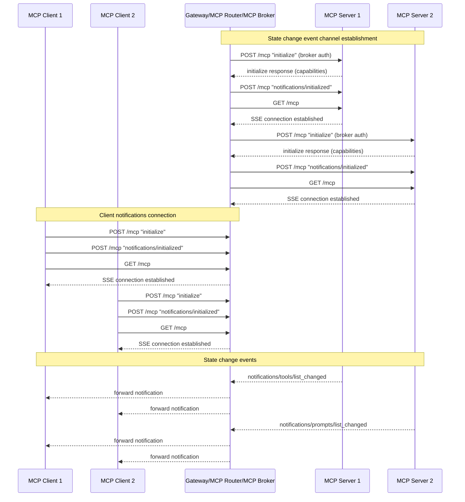
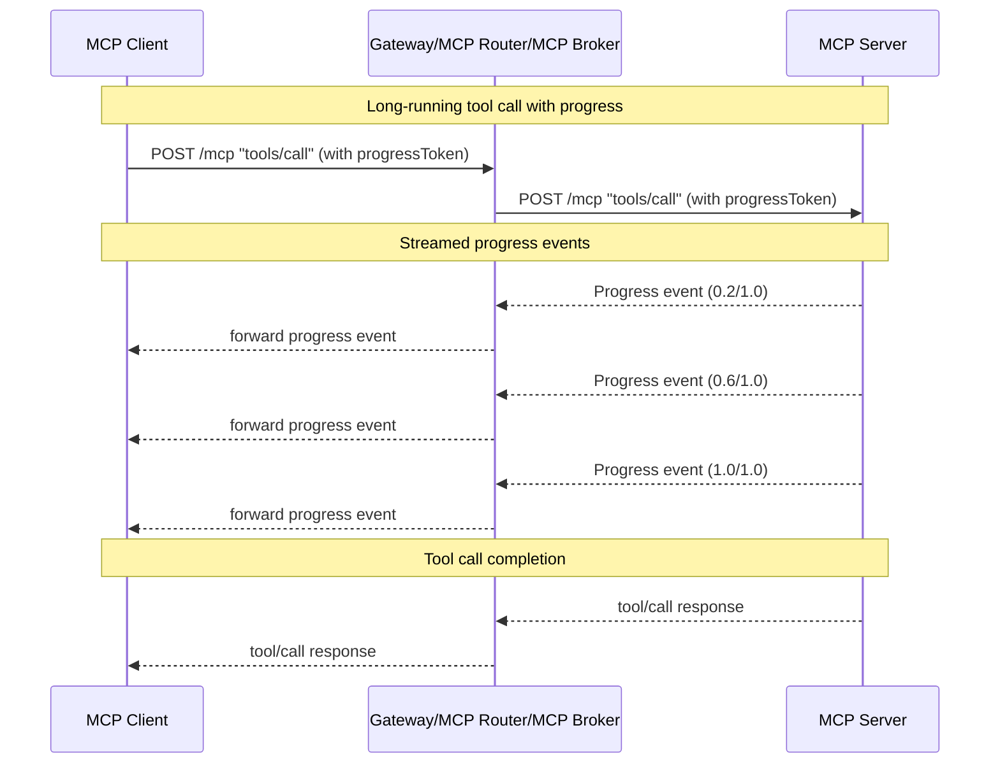
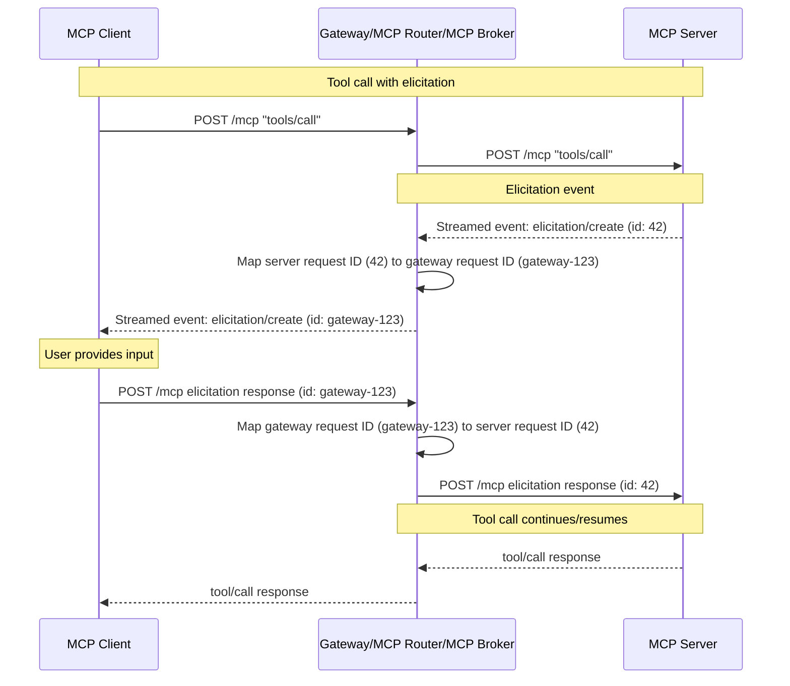

## Notifications

### Implementation Status

| Feature | Status | Notes |
|---------|--------|-------|
| `notifications/tools/list_changed` (upstream detection) | Implemented | MCPManager detects and re-fetches tools |
| `notifications/tools/list_changed` (client forwarding) | Implemented | MCP Go SDK dispatch, filtered per session by the broker's targeting middleware; E2E tested |
| Progress updates (streamed in tool call POST) | Implemented | Handled by the MCP Go SDK; covered by `tools-call-with-progress` conformance test |
| Elicitation request/response routing (form mode) | Implemented | JSON-RPC request ID mapping; E2E tested |
| `notifications/elicitation/complete` | No changes needed | Pass-through; see URL Mode Elicitation section |
| `URLElicitationRequiredError` (code -32042) | No changes needed | Pass-through; see URL Mode Elicitation section |
| `notifications/resources/list_changed` | Not applicable | Gateway does not federate resources |
| `notifications/prompts/list_changed` | Not applicable | Gateway does not federate prompts |
| `notifications/roots/list_changed` | Not applicable | Gateway does not federate roots |

### Problem

The MCP protocol supports real-time notifications that enable servers to inform clients about changes without being explicitly requested. These notifications are crucial for maintaining synchronization between clients and servers when:

- Tool lists change (e.g., `notifications/tools/list_changed`)
- Resource lists change (e.g., `notifications/resources/list_changed`) 
- Prompt lists change (e.g., `notifications/prompts/list_changed`)
- Root lists change (e.g., `notifications/roots/list_changed`)
- Long-running tool calls emit progress updates
- Elicitation requests are made (e.g., `elicitation/create`) - This is particularly important for prompting users before destructive actions, and for out-of-band authentication URL elicitation (see [MCP GitHub issue #1036](https://github.com/modelcontextprotocol/modelcontextprotocol/issues/1036))

For more details on MCP notifications, see the [MCP Architecture documentation](https://modelcontextprotocol.io/docs/learn/architecture#notifications).

In the MCP Gateway architecture, clients connect to the gateway's `/mcp` endpoint, which is backed by the MCP Broker. The broker aggregates multiple backend MCP servers and presents them as a unified MCP server to clients. This aggregation creates a challenge: how should notifications from individual backend MCP servers be forwarded to the appropriate clients?

The gateway uses a **lazy initialization** approach where backend sessions to MCP servers are only established when a client makes a tool call. However, some notifications (like `list_changed` notifications) are logically 'broadcast' notifications and should be sent to all connected clients, not just those who have made tool calls.

### Non-Goals

At this time, the MCP Gateway does **not** support elicitation requests that require out-of-band communication over the GET `/mcp` notification channel. Only state change events that are logically 'broadcast' (safe to send to all connected clients) are supported over the GET notification channel.

This is a technical limitation due to the complexity of implementing a fan-out approach where the broker would need to maintain separate GET connections to each backend MCP server for each client, particularly when those connections require the client's authentication credentials. The challenges include:

- Managing per-client, per-server GET connections with client-specific authentication
- Connection lifecycle management and reconnection logic for multiple fan-out connections
- Resource overhead of maintaining many concurrent connections

Progress updates are streamed as events within tool call POST responses by the MCP Go SDK, which naturally aligns with the client's authentication context and tool call lifecycle. Elicitation support is planned but not yet implemented.

### Solution

The MCP Gateway supports two distinct types of notification mechanisms:

1. **State Change Events**: Notifications that are safe to send to all connected clients (e.g., `notifications/tools/list_changed`, `notifications/resources/list_changed`, `notifications/prompts/list_changed`, `notifications/roots/list_changed`). These are received via persistent Server-Sent Events (SSE) connections the broker maintains to all backend MCP servers using the broker's configured authentication credentials.

2. **Client-Specific Events**: Events related to specific client sessions that are streamed as part of tool call POST responses:
   - Progress updates for long-running tool calls
   - Elicitation requests that require client interaction

The broker maintains a Server-Sent Events (SSE) connection with each connected client for receiving state change events. When the broker receives a state change event from a backend MCP server, it forwards it to all currently connected clients via their respective GET connections.

> Note: For detailed information on MCP notification specifications, see the [MCP Prompts specification](https://modelcontextprotocol.io/specification/2025-06-18/server/prompts#list-changed-notification) and the [MCP Architecture documentation](https://modelcontextprotocol.io/docs/learn/architecture#notifications).

### Notification Architecture

#### State Change Events

> **Implementation Note**: The `notifications/tools/list_changed` event is fully implemented. The MCPManager detects this notification from upstream servers and re-fetches the tool list. The MCP Go SDK handles forwarding state change notifications to all connected clients via their GET SSE connections. Other state change events (`resources/list_changed`, `prompts/list_changed`, `roots/list_changed`) are not applicable as the gateway currently only federates tools.

State change events are notifications that are safe and appropriate to send to all connected clients. The gateway supports the following state change events:

- `notifications/tools/list_changed` - When a backend MCP server's tool list changes
- `notifications/resources/list_changed` - When a backend MCP server's resource list changes  
- `notifications/prompts/list_changed` - When a backend MCP server's prompt list changes
- `notifications/roots/list_changed` - When a backend MCP server's root list changes

**How State Change Events Work:**



1. **Capability Checking**: When a backend MCP server is discovered, the broker first sends an `initialize` request using the broker's configured authentication credentials. The broker checks the `initialize` response to determine which state change event [capabilities](https://modelcontextprotocol.io/specification/2025-06-18/server/resources) the server supports (e.g., `notifications/tools/list_changed`, `notifications/resources/list_changed`, etc.).

2. **Persistent Broker Connections**: For each backend MCP server that supports state change events, the broker establishes a persistent GET connection:
   - Sends a `notifications/initialized` notification
   - Establishes a GET `/mcp` connection for receiving SSE notifications
   
   These connections remain open for the lifetime of the backend server connection. The broker must implement reconnection logic to handle cases where connections are dropped due to server restarts, session invalidation, or network issues.

3. **Event Reception and Forwarding**: When a backend MCP server sends a state change event (e.g., `notifications/tools/list_changed`), the broker receives it via the persistent connection and forwards it to all currently connected clients via their respective GET connections.

4. **Client Response**: Clients typically respond to `list_changed` notifications by making a new `tools/list`, `resources/list`, `prompts/list`, or `roots/list` request to refresh their understanding of available primitives.

**Why Broker Auth for State Change Events:**

The broker uses its own authentication credentials (configured at startup) rather than client credentials because state change events are not tied to any specific client session, must be received even when no clients have made tool calls yet, and allows the broker to maintain a single persistent connection per backend server rather than per client.

#### Gateway-Initiated Notifications: Targeting and the Sentinel Tool

> **Implementation Note**: `internal/broker/gateway_server.go` (`TriggerToolsListChanged`, `shouldDeliver`, `notifyTargetMiddleware`).

Some tool-list changes originate in the gateway itself rather than an upstream server: `select_tools` changes one session's tool scope, so only that session should be told to re-list. The MCP Go SDK broadcasts `notifications/tools/list_changed` to every connected session and exposes no per-session send, so the broker layers targeting on top of the SDK's dispatch:

- **Sentinel tool trigger**: the SDK dispatches `tools/list_changed` only when its tool set changes; there is no direct notify trigger. `TriggerToolsListChanged` adds and immediately removes a no-op sentinel tool (`__gateway_scope_change`), and the SDK's debounced dispatch (~10ms) coalesces the pair into a single notification. The sentinel is registered directly on the SDK server, never in the gateway's own tool tracking, and `FilterTools` drops it from `tools/list` responses, so it is never client-visible even if a list races the add/remove window.
- **Targeting claims**: the SDK dispatch is asynchronous and debounced, so targeting state must outlive the trigger call. Target session IDs are claimed with an expiry (`notifyWindow`, 5s) and expire lazily rather than being cleared synchronously.
- **Delivery predicate**: a sending middleware on the SDK server intercepts each outbound `tools/list_changed` and consults `shouldDeliver`, which is fail-open: delivery is suppressed only when live targets exist, no broadcast is pending, and the session is not among the targets. A spurious delivery merely causes a re-list; a missed one loses state.
- **Broadcast and coalescing**: upstream-driven tool changes (`AddTools`/`DeleteTools`) mark a pending broadcast claim. While one is live, every session receives the dispatch even if targets are pending, so a dispatch that coalesces a targeted trigger with an upstream change never starves non-target sessions.

#### Client-Specific Events

> **Implementation Note**: Progress updates work without special gateway implementation — the MCP Go SDK streams progress events as part of the tool call POST response. Elicitation support is not yet implemented and requires the request ID mapping infrastructure described below.

Client-specific events are related to a particular client's tool execution and are delivered as streamed events within the tool call POST response, not via separate GET notification channels. The gateway supports two types of client-specific events:

1. **Progress Updates**: Progress notifications for long-running tool calls
2. **Elicitations**: Requests for user input during tool execution (e.g., confirming destructive actions)

> **Note**: The gateway does not currently support other client-specific notifications/events such as:
> - Log message notifications (`logging/setLevel` and `notifications/message`) - See [MCP Logging specification](https://modelcontextprotocol.io/specification/2025-06-18/server/utilities/logging#log-message-notifications)
> - Subscribe requests (`resources/subscribe` and `notifications/resources/updated`) - See [MCP SubscribeRequest schema](https://modelcontextprotocol.io/specification/2025-06-18/schema#subscriberequest)

**How Progress Updates Work:**

> **Implementation Note**: This is handled transparently by the MCP Go SDK. The gateway forwards the tool call POST request to the backend, and the SDK streams progress events back to the client as part of the same HTTP response. No special gateway logic is required.

Progress updates are streamed events sent by the backend MCP server as part of the `tools/call` POST response. The client indicates they want progress updates by including a `progressToken` field in the tool call request with an arbitrary value. The backend server uses this token to associate progress events with the specific tool call. See the [MCP Progress specification](https://modelcontextprotocol.io/specification/2025-06-18/basic/utilities/progress#progress) for more details.



**How Elicitations Work:**

> **Implementation Note**: Form mode elicitation (request/response routing with JSON-RPC request ID mapping) is implemented and E2E tested. URL mode flows (completion notifications and `URLElicitationRequiredError`) require no gateway changes; see the URL Mode Elicitation section below.

Elicitations allow backend MCP servers to request user input during tool execution. When an `elicitation/create` event is sent, the tool call on the server halts, waiting for the client's response. The elicitation message contains a unique request ID that the client must use when responding. See the [MCP Elicitation specification](https://modelcontextprotocol.io/specification/2025-06-18/client/elicitation#elicitation) for more details.

The gateway must intercept and modify the request ID in the elicitation message to enable proper routing of the client's follow-up response to the correct backend MCP server.



**Example Elicitation Message:**

```json
{
  "method": "elicitation/create",
  "params": {
    "message": "Please provide inputs for the following fields:",
    "requestedSchema": {
      "type": "object",
      "properties": {
        "name": {
          "title": "Full Name",
          "type": "string",
          "description": "Your full, legal name"
        },
        "check": {
          "title": "Agree to terms",
          "type": "boolean",
          "description": "A boolean check"
        }
      },
      "required": ["name"]
    }
  },
  "jsonrpc": "2.0",
  "id": 1
}
```

**Example Client Response:**

```json
{
  "result": {
    "action": "accept"
  },
  "jsonrpc": "2.0",
  "id": 1
}
```

**Request ID Mapping for Elicitations:**

Since elicitation responses arrive as new POST requests from the client, the router must maintain a mapping that associates:
- The gateway-assigned request ID (sent to the client)
- The original backend server request ID
- The backend server session (for routing)
- The gateway session ID (to validate the responding client matches the original)

When forwarding an elicitation to the client, the gateway replaces the backend server's request ID with a gateway-specific ID. When the client responds, the gateway uses the mapping to restore the original request ID and route the response to the correct backend server session.

#### URL Mode Elicitation

URL mode elicitation introduces two additional server-to-client messages. Both work with the current gateway design without changes because the gateway's request ID rewriting is scoped to `elicitation/create` messages only. All other messages in the tool call response stream pass through unmodified.

**`notifications/elicitation/complete`**: After a client completes an out-of-band action at a URL, the backend server may send this notification in the tool call response stream. The notification uses `params.elicitationId` (not the JSON-RPC request ID) to identify the completed elicitation. The gateway does not need to rewrite this notification because:
- It has no JSON-RPC `id` field (it is a notification, not a request)
- The `elicitationId` is a value the gateway never modifies — request ID rewriting only applies to the JSON-RPC `id` on `elicitation/create`

The request ID mapping created for the original `elicitation/create` is cleaned up when the tool call response stream ends, so no early cleanup on notification receipt is needed.

```json
{
  "jsonrpc": "2.0",
  "method": "notifications/elicitation/complete",
  "params": {
    "elicitationId": "550e8400-e29b-41d4-a716-446655440000"
  }
}
```

**`URLElicitationRequiredError` (code -32042)**: When a request cannot proceed until URL mode elicitation is completed, the backend server returns this error response. The gateway does not need to rewrite this because:
- It is an error response, not an `elicitation/create` request — request ID rewriting does not apply
- The JSON-RPC `id` in the error matches the client's original request ID, which the gateway does not modify for tool call requests
- The `elicitationId` and `url` fields inside `error.data` are opaque to the gateway

```json
{
  "jsonrpc": "2.0",
  "id": 2,
  "error": {
    "code": -32042,
    "message": "This request requires more information.",
    "data": {
      "elicitations": [
        {
          "mode": "url",
          "elicitationId": "550e8400-e29b-41d4-a716-446655440000",
          "url": "https://mcp.example.com/connect?elicitationId=550e8400",
          "message": "Authorization is required to access your Example Co files."
        }
      ]
    }
  }
}
```

### Implementation Considerations

1. **Connection Management**: The broker must efficiently manage multiple concurrent connections:
   - One persistent GET connection per backend MCP server (for state change events)
   - One GET connection per connected client (for receiving state change events)
   - Long-running POST connections for tool calls that emit progress updates or elicitations

2. **Capability Detection**: The broker must check the `initialize` response from each backend MCP server to determine which state change event capabilities are supported before establishing GET notification connections.

3. **Request ID Mapping**: The router maintains a mapping table for elicitation request IDs that includes:
   - Gateway-assigned request ID (random UUID)
   - Original backend server request ID
   - Backend server name and session
   - Gateway session ID (for response validation)
   - Expiration/TTL to clean up stale mappings (1-hour safety-net TTL in Redis)

   **Request ID Type Handling**: Backend MCP servers may use request IDs of different types (string, integer, or float). The mapping preserves the original type so it can be restored when forwarding the client's response to the backend.

4. **Error Handling and Reconnection**: The broker must handle:
   - Backend MCP server connection failures
   - Client connection failures
   - Event delivery failures
   - Connection retry logic with exponential backoff
   - Automatic reconnection when backend servers restart
   - Session invalidation detection and reconnection
   - Network interruption recovery

5. **Lifecycle Management**: The broker must properly:
   - Establish state change event connections when backend servers are discovered (after capability checking)
   - Clean up connections when backend servers are removed
   - Manage long-running POST connections for tool calls with progress/elicitation

   The router cleans up elicitation request ID mappings when the tool call response stream ends, or when the client's elicitation response is successfully forwarded.

### Security Considerations

1. **Event Validation**: The broker should validate that state change events received from backend MCP servers are well-formed and safe to forward before broadcasting them to clients.

2. **Authorization**: The broker forwards events as-is but relies on the backend MCP server's authorization rules, if any, tied to the broker auth credentials configured for each MCP Server.

3. **Request ID Mapping Security**: The gateway-assigned request IDs in elicitation mappings should be cryptographically random and unguessable to prevent unauthorized access to tool call sessions.

### Resolved Questions

1. **Elicitation Mapping Cleanup**: Mappings persist for the tool call duration and are removed when the response stream ends. In Redis-backed deployments, a 1-hour TTL acts as a safety net for orphaned entries.
