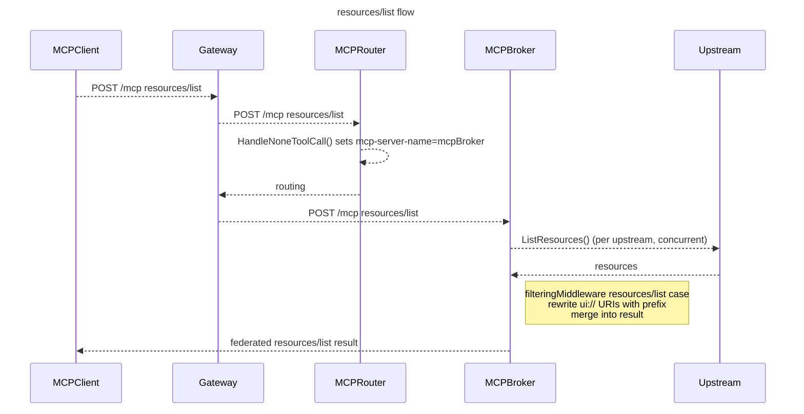
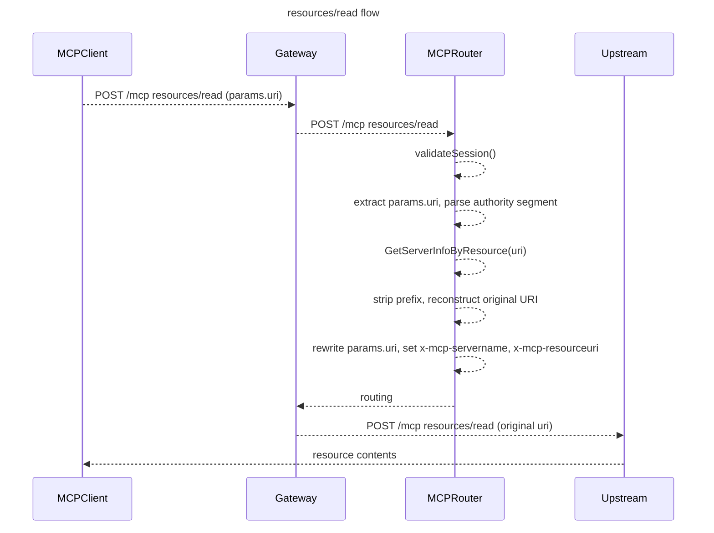
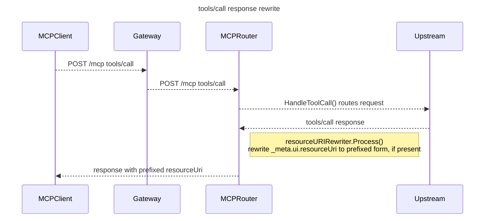

# Feature: MCP Resources Federation

## Summary

Add partial support for federating MCP Resources through the gateway. The broker aggregates resource lists from all connected upstreams at request time, rewrites `ui://` URIs with a per-server prefix to avoid collisions, and merges the results. The router dispatches `resources/read` to the correct upstream by parsing the prefix from the URI. A response-path step handles `_meta.ui.resourceUri` fields in `tools/call` responses so the URI the client gets from a tool result stays consistent with what `resources/list` returns. Ref: [#788](https://github.com/Kuadrant/mcp-gateway/issues/788), split from [#208](https://github.com/Kuadrant/mcp-gateway/issues/208).

## Goals

- Federate `resources/list` and `resources/read` from multiple upstream servers through a single gateway endpoint
- Rewrite `ui://` URIs using the server's existing `prefix` to avoid cross-upstream collisions
- Route `resources/read` to the correct upstream by parsing the prefixed URI
- Rewrite `_meta.ui.resourceUri` in `tools/call` responses to match the prefixed form
- Set `x-mcp-resourceuri` on `resources/read`, alongside the existing `x-mcp-servername`, so AuthPolicy can enforce access per resource, mirroring `x-mcp-toolname` for tools

## Non-Goals

- Non-`ui://` URI schemes - tracked in [#1238](https://github.com/Kuadrant/mcp-gateway/issues/1238)
- Resource subscriptions - the 2026-07-28 spec update (SEP-2567) removes protocol sessions and restricts server-to-client requests, fundamentally changing the delivery model. Scope narrowed per [guidance on #788](https://github.com/Kuadrant/mcp-gateway/issues/788#issuecomment-4682923399); tracked separately as #597 (closed)
- URI templates (`resources/templates/list`) - `x-mcp-resourceuri` per-resource enforcement (see Authorization) only applies to the fixed, listable resources this design handles; a template has no single fixed value to place in the header, so enforcement does not extend to it
- Stateless (Streamable HTTP) protocol support
- VirtualServer filtering for resources
- `cacheScope` / `ttlMs` cache-aware proxying (SEP-2549, future consideration - see [scoping discussion on #788](https://github.com/Kuadrant/mcp-gateway/issues/788#issuecomment-4682923399)). If built, invalidation should be `ttlMs`-based rather than relying on `notifications/resources/list_changed`, since SEP-2567 restricts the server-to-client push that notification depends on.
- Pagination - `resources/list` supports cursor-based pagination in the spec; aggregating cursors across multiple upstreams is a non-trivial problem deferred to a follow-up. In the meantime, each upstream is only fetched for its first page: a `nextCursor` in an upstream's response is not followed, so that upstream's remaining resources are left out of the federated list. The `resources/list` case in `filteringMiddleware` logs when an upstream's response includes a `nextCursor`, so a paginated upstream showing up as partial is observable rather than silent, the same treatment as an upstream that errors or times out.

## Design

### Backwards Compatibility

No breaking changes. No CRD fields are added or renamed, no existing headers are modified, and no existing methods change signature. The `resources` key in the `x-mcp-authorized` JWT was already reserved as part of the prompts federation design. `resources/list` and `resources/read` are not handled today, so there is nothing to break.

### URI Prefixing

The gateway injects the server's existing `prefix` into the authority segment of the `ui://` URI:

```text
ui://template.html  →  ui://{prefix}template.html
```

For example, with prefix `insights_`:
```text
ui://template.html  →  ui://insights_template.html
```

The router extracts the prefix back out by matching the authority against registered server prefixes.

**Longest-prefix match**: if a resource's authority is ambiguous between two registered prefixes (for example `ui://app_admin_template.html` could parse as prefix `app_` plus name `admin_template.html`, or prefix `app_admin_` plus name `template.html`), the router resolves it to the server with the longest matching prefix. This mirrors the longest-prefix-match approach `GetServerInfo` already uses for `userSpecificList` tool routing. It does not eliminate the collision, it picks a winner deterministically: the shorter-prefix server's resource becomes unreachable via `resources/read` since both compute to the same URI.

**Servers without a prefix cannot participate in resource federation.** Without a prefix, the gateway has no way to distinguish a resource's origin and cannot route `resources/read` correctly. This is enforced at list time - resources from a no-prefix server are excluded from the `resources/list` result.

**Conflict detection**: Exact-duplicate prefixes and substring-prefix collisions are two distinct cases, not one. There is no registration-time validation today that rejects either case, exact duplicates or one prefix being a prefix of another (the CRD's `prefix` pattern only validates charset and immutability, not uniqueness across registrations). For exact duplicates, this needs an actual enforcement mechanism, either an admission webhook or a controller-side check, not just documentation asserting it's already handled. For substring collisions, see "Longest-prefix match" above: this case is explicitly not prevented, the router resolves it deterministically but the shadowing trade-off is accepted, not eliminated.

**Prefix safety for URI injection**: the CRD's existing `+kubebuilder:validation:Pattern=^[a-z0-9][a-z0-9_]*$` on `prefix` already restricts it to `[a-z0-9_]`, so today's tool-naming validation happens to be URI-authority-safe too. That's coincidental, not designed in - the pattern exists to stop tool-name collisions, not to guarantee URI safety, and tools/prompts only ever concatenate the prefix as a plain string. Blocklisting just `/`, `?`, and `#` isn't enough defense-in-depth on its own: if the CRD pattern is ever loosened, characters like `@`, `:`, brackets, or percent-encoding can still change how a URI's authority is parsed or normalized without being any of those three. As defense-in-depth, `GetServerInfoByResource` and the URI-rewrite path both re-validate the prefix against an allowlist, the same `[a-z0-9_]+` charset the CRD pattern already enforces, rather than blocklisting a handful of unsafe characters, independent of the CRD validation itself. A server whose prefix fails this check is excluded from resource federation, same as a server with no prefix at all - so a future loosening of the CRD pattern for tool-naming reasons can't silently open a URI-injection path for resources.

### Architecture

No new components. The existing broker, upstream connections, and router are extended.

Unlike tools and prompts, resources will not be pre-registered into mcp-go. An upstream can expose a large number of resources and pre-registering them would duplicate upstream state with no benefit. A `resources/list` case in `filteringMiddleware` fetches from each upstream at request time instead. Since nothing is pre-registered via `AddResource`, the broker must also explicitly advertise the `resources` capability, the same way it force-sets the `tools` capability today.

**resources/list flow:**



**resources/read flow:**



**tools/call with `_meta.ui.resourceUri` (response rewrite):**



### Component Changes

| Component | File | Change |
|---|---|---|
| Upstream client | `internal/broker/upstream/mcp.go` | Add `SupportsResources()` and `ListResources()` to the `MCP` interface |
| Upstream connection | `internal/broker/upstream/manager.go` | Add `ListResources()` for pull-time fetching; no pre-registration |
| Broker | `internal/broker/broker.go` | Enable resource capabilities, gated on at least one upstream supporting resources, following the same pattern as prompts; add a `resources/list` case to `filteringMiddleware`; add `GetServerInfoByResource()` to `MCPBroker` interface |
| Router request | `internal/mcp-router/request_handlers.go` | Add `HandleResourceRead()`, reusing the existing `validateSession()` check `HandleToolCall` already uses; set `x-mcp-servername` via `headers.WithMCPServerName(serverInfo.Name)` and `x-mcp-resourceuri` via `headers.WithMCPResourceURI(uri)` before routing, mirroring how `HandleToolCall` sets `x-mcp-servername`/`x-mcp-toolname` today, so AuthPolicy can enforce per-resource access (see Authorization); add `resources/read` case in `RouteMCPRequest`; add `ResourceURI()` to `MCPRequest` |
| Router response | `internal/mcp-router/server.go`, `internal/mcp-router/response_handlers.go`, new `internal/mcp-router/resource_rewrite.go` | Add `serverPrefix` to `MCPRequest`; construct `resourceURIRewriter` in the `ResponseHeaders` case, gated on `isToolCall() && serverPrefix != ""` (mirroring how `sseRewriter` is wired today); broaden the `ModeOverride` condition in `response_handlers.go` to also cover this case; detect and rewrite `_meta.ui.resourceUri` in `tools/call` response bodies |
| Router response (rename) | `internal/mcp-router/elicitation.go` | Rename `sseRewriter` to `elicitationRewriter` so its name reflects what it's for, now that a second response rewriter exists |
| Config / CRD | `internal/config/types.go`, `api/v1alpha1/types.go` | No changes (VirtualServer filtering out of scope) |

`GetServerInfoByResource(uri string)` parses the authority segment of the URI and does longest-prefix matching against registered server prefixes - the same approach `GetServerInfo` already uses for tools.

The `resources/list` case in `filteringMiddleware` calls `ListResources()` on each active upstream with a per-upstream timeout (same default as the broker's existing upstream timeout), rewrites the `ui://` URIs, and merges results. Upstreams that error or time out are skipped with a log - the request is not failed. Upstreams with no prefix are skipped entirely.

Unlike tools and prompts, this fetch runs live inside the client's `resources/list` request rather than in a background ticker, so a sequential loop over upstreams would add each slow or down upstream's timeout to every client's latency. The middleware fans out to all upstreams concurrently instead, following the same pattern `FetchUserSpecificTools` already uses in `internal/broker/user_specific_tools.go`: `errgroup.WithContext`, one goroutine per upstream, errors logged and swallowed rather than failing the group, and span attributes for upstream/result counts.

`notifications/resources/list_changed` from upstreams requires no handler. Because resources are fetched at request time, no callback registration is needed - unlike tools and prompts which pre-register and must react to upstream changes.

`_meta.ui.resourceUri` is a gateway convention introduced by MCP Apps (SEP-1865, referenced in [#788](https://github.com/Kuadrant/mcp-gateway/issues/788)). It is not part of the core MCP spec.

### Response Rewrite Implementation

The `_meta.ui.resourceUri` rewrite needs the originating server's prefix at response time, inside `internal/mcp-router/server.go`'s `Process()` loop. That loop already carries `mcpRequest` as a closure-scoped variable across the `RequestBody` → `ResponseHeaders` → `ResponseBody` phases of a single ext_proc stream, and `mcpRequest.serverName` is already populated during the request phase (the same lookup `HandleToolCall` uses today). No new per-request store is needed to make the prefix available at response time.

The existing `sseRewriter` (`internal/mcp-router/elicitation.go`), used today for rewriting elicitation request IDs, is the closest precedent for the Process/Flush lifecycle, but isn't a good fit to extend directly:

- It's only constructed when `clientElicitation && statusCode == "200"` - resource-URI rewriting needs to run on any tool call response, not just sessions that registered for elicitation.
- It assumes SSE framing (splits on `\n`, only rewrites `data:`-prefixed lines). A typical non-streaming `tools/call` JSON response has neither, so reusing it as-is would silently fail to rewrite plain JSON bodies.

Proposed instead: a new sibling rewriter (`resourceURIRewriter`), constructed in the `ResponseHeaders` case gated on `mcpRequest.isToolCall()` and `mcpRequest.serverPrefix != ""` (a new field set alongside `serverName` in `HandleToolCall`, from the same already-resolved `serverInfo`), following the same Process/Flush pattern but handling both plain single-JSON bodies and SSE-framed bodies (tool responses can be either, depending on the upstream's transport). Gating on the upstream having a prefix skips the rewriter, and the response body streaming it requires, for tool calls to servers that don't participate in resource federation at all, at no extra lookup cost since the prefix is already known by request time. It runs independently of the elicitation rewriter - composed, not merged into one struct, for responses that need both.

Constructing the rewriter at `ResponseHeaders` rather than `RequestBody` is required, not just convenient: Envoy only honors a streaming-mode override when it is set on a response to a headers-phase message, so the `ModeOverride` that forces the response body to stream has to happen at `ResponseHeaders` regardless of when the decision logic runs. Doing it there also means the status code is already known, so streaming can be skipped for non-200 responses, same as the existing `sseRewriter` gate does today.

`response_handlers.go`'s existing `ModeOverride` condition (currently `isToolCall() && clientElicitation && status == "200"`) needs a matching change: broaden it to also cover `isToolCall() && serverPrefix != "" && status == "200"`, so the response body actually gets streamed to the router for `resourceURIRewriter` to inspect. This means every tool-call response from a resource-federated server streams through ext_proc, not just ones that end up containing a `_meta.ui.resourceUri` field - there is no per-tool signal available to narrow this further without new metadata the MCP spec does not currently expose.

As part of this change, `sseRewriter` gets renamed to `elicitationRewriter`. It was named for its SSE framing, but now that there's a second, different response rewriter, naming both after what they rewrite (elicitation IDs vs. resource URIs) instead of how they parse the body is clearer.

### Authorization

The `x-mcp-authorized` JWT already reserves a `resources` key in the `allowed-capabilities` claim, defined as part of the prompts federation design:

```json
{
  "tools": { "insights-server": ["get_forecast"] },
  "prompts": { "insights-server": ["weather_summary"] },
  "resources": { "insights-server": ["ui://insights_template.html"] }
}
```

A new `filtered_resources_handler.go` mirrors `filtered_prompts_handler.go`. Tools and prompts filter a pre-populated set; resources filter **per-upstream, inside the `filteringMiddleware` `resources/list` case, before the results get merged** - each upstream's list is filtered on its own, matching the per-server structure of the `resources` claim in the JWT.

Enforcement doesn't change here: a missing `resources` key makes no assertion about resources (`enforceCapabilityFilter` still governs behavior), and an empty map (`"resources": {}`) explicitly denies all resources.

**Per-resource enforcement**: the `resources` JWT claim and `filtered_resources_handler.go` only control what appears in `resources/list` - they say nothing about what `resources/read` will serve. To close that, `HandleResourceRead` sets `x-mcp-resourceuri` (the resolved, unprefixed URI) as a routing header alongside `x-mcp-servername`, the same way `HandleToolCall` sets `x-mcp-toolname` alongside `x-mcp-servername` for tools. This lets AuthPolicy key on the specific resource being read, not just the destination server, matching the per-item enforcement tools and prompts already get via `x-mcp-toolname`/`x-mcp-promptname`. Like those headers, `x-mcp-resourceuri` is router-set only - parsed from `params.uri` before AuthPolicy evaluates, never client-settable.

This only covers the fixed, listable resources this design handles (see Non-Goals): URI templates (`resources/templates/list`) have no single fixed value to place in the header, so per-resource enforcement does not extend to them.

### Security Considerations

- Prefix values are re-validated against an allowlist (`[a-z0-9_]+`), not a blocklist of a few unsafe characters, at the point they're injected into a `ui://` authority segment, independent of the CRD's `prefix` pattern validation - defense-in-depth in case that pattern is loosened later for tool-naming reasons alone. See "Prefix safety for URI injection" above.
- URI prefix matching is done against the server's registered prefix, not free-form input from the client. An unrecognized prefix in `resources/read` returns a routing error, same as an unknown tool name.
- The `_meta.ui.resourceUri` rewrite only applies to `ui://` URIs. A non-`ui://` value or malformed URI in `_meta` is left untouched.
- `resources/read` routing uses the same client auth flow as `tools/call` - the client's Authorization header flows through to the upstream. `credentialRef` on MCPServerRegistration is only for broker-to-upstream connections, not client-facing auth.
- No new privilege escalation surface. Resources are a distinct capability from tools and prompts in the JWT claim - authorization for tools on a server does not grant access to its resources.
- `resources/read` gets the same per-item enforcement as tools and prompts: `HandleResourceRead` sets both `x-mcp-servername` and `x-mcp-resourceuri` as routing headers, so AuthPolicy can restrict access down to a specific resource, not just the destination server (see Authorization). This closes what would otherwise be a narrower guarantee than tools/prompts get, and is not the same as the documented `MCPVirtualServer` listing-versus-calling gap tools already have (see `docs/design/security-architecture.md`) - that gap is about listing vs. calling, this is about per-item enforcement being available at all.
- Per-resource enforcement only applies to fixed, listable resources - URI templates (`resources/templates/list`) are out of scope for this design (see Non-Goals) and have no fixed URI to enforce against.

### Forward Compatibility

Two spec changes are coming that will reshape how clients and servers connect: SEP-2575 drops the `initialize`/`initialized` handshake, and SEP-2567 drops protocol sessions and restricts server-to-client requests. This design mostly stays out of the way of both, so there's little to unwind later:

- **No session-scoped cache.** The `resources/list` case in `filteringMiddleware` fetches live on every `resources/list` call instead of caching per-session state, unlike tools/prompts.
- **No subscriptions.** Left out of scope (see Non-Goals) precisely because they'd depend on the server-to-client push SEP-2567 removes.
- **One shared coupling point.** Upstream access goes through the same `MCP` interface and connection abstraction as `ListTools`/`ListPrompts` (see Future Considerations for the detail) - a handshake change is one shared migration, not a resources-specific one.
- **Prefix-based routing.** `GetServerInfoByResource` resolves the upstream from the registered `prefix`, no session involved.
- **Rewriting is stream-scoped, not session-scoped.** `resourceURIRewriter` correlates request and response through the ext_proc `Process()` loop, an Envoy-level mechanism that has nothing to do with the MCP handshake.
- **Session validation is reused, not new.** `HandleResourceRead` calls the same `validateSession()` as `HandleToolCall`.

### Open Questions

1. **Partial list on upstream failure**: If one upstream times out during the `resources/list` fetch, the gateway returns a partial resource list. Is this acceptable, or should the request fail entirely?

   Resolved: partial is acceptable, consistent with how tools and prompts already behave, one upstream's failure never fails the aggregate list (`internal/broker/upstream/manager.go`). Tools and prompts recover on the next background ticker tick, bounded by backoff; resources have no such window because the `resources/list` fetch happens live on every request, so a recovered upstream is picked up on the very next `resources/list` call with no caching layer to invalidate. `resources/read` routing is unaffected either way, since it only depends on the registered prefix, not on the last list fetch succeeding.

### Future Considerations

- **Stateless / session-less spec evolution**: both SEP-2575 and SEP-2567 are unreleased, and per [maintainer guidance on #788](https://github.com/Kuadrant/mcp-gateway/issues/788#issuecomment-4682923399) this design stays narrowed to the current, stateful spec rather than building against either (see "Forward Compatibility" above for why that's a safe bet). The one real coupling point for whoever picks this up later: `ListResources()` goes through the same upstream connection abstraction in `internal/broker/upstream/manager.go` that `ListTools`/`ListPrompts` already use, rather than a resources-specific connection path. If the handshake model changes, that's a single shared migration, not three divergent ones, and it's not specific to resource federation either: it would affect the broker's existing tool/prompt capability advertisement just as much, so any future redesign belongs at that shared layer, not here.
- **`docs/guides/authorization.md` example**: that guide's Step 2 shows an AuthPolicy keyed on `x-mcp-toolname`/`x-mcp-promptname`; once `x-mcp-resourceuri` ships it should get the same treatment. Deferred to a follow-up rather than done alongside this design, since the guide documents a working system and the header doesn't exist until this is implemented.

## Testing Strategy

- **Unit tests**: `ListResources()` per upstream; URI rewriting (prefix injection and stripping for `ui://`, including the longest-prefix-match case for overlapping prefixes); `GetServerInfoByResource()` prefix matching; `HandleResourceRead()` body rewriting and `x-mcp-servername`/`x-mcp-resourceuri` header setting; `filteringMiddleware` resources/list merging; `_meta.ui.resourceUri` rewrite in the response handler; resource filtering via `x-mcp-authorized`. Mirror the tool and prompt test patterns in `manager_test.go`, `broker_test.go`, `request_handlers_test.go`.
- **E2E tests**: Register a server with `ui://` resources, verify `resources/list` returns prefixed URIs, call `resources/read` and verify contents are returned, verify `_meta.ui.resourceUri` in a tool response is prefixed. Verify an AuthPolicy keyed on `x-mcp-resourceuri` can allow one resource and deny another on the same server. Test with multiple servers to confirm prefix isolation. Add a `ui://` resource to the existing `server1` test server (which already exposes an `embedded:info` resource) rather than standing up a dedicated test server.

## References

- [MCP Resources Specification (2025-03-26)](https://modelcontextprotocol.io/specification/2025-03-26/server/resources)
- [MCP spec blog: 2026-07-28 release candidate](https://blog.modelcontextprotocol.io/posts/2026-07-28-release-candidate/)
- [Issue #788 - Add support for MCP Resources federation](https://github.com/Kuadrant/mcp-gateway/issues/788) - includes SEP-1865 (MCP Apps UI rendering) as the motivating use case and the source of `_meta.ui.resourceUri`
- [#788 comment - scope update for the 2026-07-28 spec RC](https://github.com/Kuadrant/mcp-gateway/issues/788#issuecomment-4682923399) - maintainer guidance narrowing scope to `resources/list`/`resources/read`, closing subscriptions, and flagging the new caching model
- [Issue #1238 - Full MCP Resources federation (general URI schemes)](https://github.com/Kuadrant/mcp-gateway/issues/1238)
- [Prompts federation design doc](https://github.com/Kuadrant/mcp-gateway/blob/main/docs/design/prompts-federation.md)
- `filteringMiddleware` (`internal/broker/broker.go`) - the `mcp.Middleware` pattern from the official MCP Go SDK this design builds on, replacing the pre-migration mcp-go hooks API this doc previously referenced
