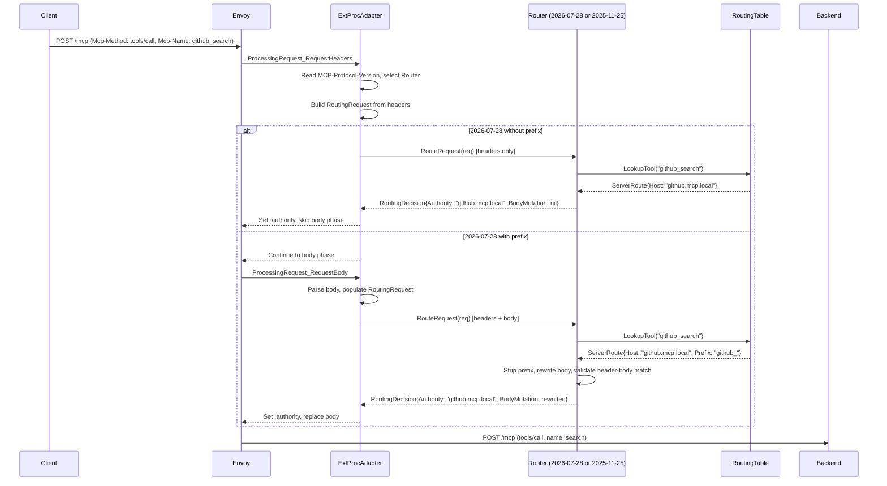

# Router: MCP `2026-07-28` Protocol Support

## Problem

The router is tightly coupled to `2025-11-25` protocol semantics — body parsing for every routing decision, session management, hairpin initialization, elicitation ID rewriting. The `2026-07-28` spec makes most of this unnecessary: `Mcp-Method` and `Mcp-Name` headers enable header-based routing, sessions are removed, and elicitation is stateless. The router needs to support both protocols during a transition period while isolating the `2025-11-25` code for eventual removal.

Additionally, the router imports `internal/broker` for the `MCPBroker` interface (4 methods) to resolve tool names to servers. This coupling prevents independent deployment and complicates the future Praxis port.

## Summary

Extract routing logic behind a `Router` interface with two implementations: one for `2026-07-28` (header-based, stateless) and one for `2025-11-25` (body-based, stateful). The ext_proc `Process` loop becomes a thin adapter that selects the implementation based on `MCP-Protocol-Version`. The broker dependency is replaced by a routing table the router consumes as a cached dataset.

## Goals

- **G1:** Support `2026-07-28` routing: `Mcp-Method`/`Mcp-Name` header-based routing, `:authority` rewrite, prefix stripping, `Mcp-Name` header rewrite.
- **G2:** Isolate `2025-11-25` code path so it can be removed without touching the `2026-07-28` path.
- **G3:** Zero broker imports in router. Replace `MCPBroker` interface with a routing table.
- **G4:** Define the `Router` interface as the contract for a future Praxis adapter.
- **G5:** Validate `Mcp-Name` and `Mcp-Method` headers match the body (spec requirement: server must reject mismatches with `HeaderMismatch` error).

## Non-Goals

- Praxis filter implementation (Phase 2, separate design)
- Broker changes for `2026-07-28` (`server/discover`, `InputRequiredResult`, `ttlMs` — separate design)
- `2025-11-25` deprecation or removal
- Independent deployment of router and broker
- Changes to controller or operator

## Job Stories

### When a `2026-07-28` client calls a tool

When an MCP client sends `tools/call` with `MCP-Protocol-Version: 2026-07-28`, `Mcp-Method: tools/call`, and `Mcp-Name: github_search`, the router wants to route the request to the github backend using only headers so that no body parsing is needed for the routing decision.

### When a `2026-07-28` client calls a tool with a prefix

When the MCPServerRegistration has `prefix: github_` and the client sends `Mcp-Name: github_search`, the router wants to strip the prefix from both the `Mcp-Name` header and the body `name` field, rewriting both to `search`, so that the upstream receives the unprefixed tool name and headers match the body (spec requirement).

### When a `2026-07-28` client calls a tool without a prefix

When the MCPServerRegistration has no prefix and the client sends `Mcp-Name: search`, the router wants to route entirely on headers without entering the body phase so that latency is minimized.

### When a `2025-11-25` client calls a tool

When an MCP client sends a request without `MCP-Protocol-Version` or with `MCP-Protocol-Version: 2025-11-25`, the router wants to use the existing body-based routing and session management so that backward compatibility is preserved.

### When headers and body disagree

When a `2026-07-28` client sends `Mcp-Name: search` in the header but `"name": "get_weather"` in the body, the router wants to reject the request with a `HeaderMismatch` error so that the spec's header-body consistency requirement is enforced.

### When a tool is not in the routing table

When the router receives a `tools/call` for a tool name not found in the routing table and not matching any prefix, the router wants to return a tool-not-found error so that the client gets a clear error.

## Design

### Prerequisites

- `mcp-go` SDK must support `2026-07-28` types (or the router must handle new types independently of the SDK for the routing path)

### Router interface

```go
// RoutingDecision is the output of a routing decision
type RoutingDecision struct {
    Authority    string            // :authority header value (backend HTTPRoute hostname)
    Path         string            // :path override (backend path)
    SetHeaders   map[string]string // headers to set on the request
    UnsetHeaders []string          // headers to remove
    BodyMutation []byte            // nil if no body change needed
    Error        *RoutingError     // non-nil if the request should be rejected
}

// RoutingError represents a rejection
type RoutingError struct {
    StatusCode int
    Message    string
    JSONRPCErr string // optional JSON-RPC error body for SSE responses
}

// Router defines the routing contract independent of any transport adapter
type Router interface {
    // RouteRequest makes a routing decision from request metadata.
    // For header-only routing (2026-07-28 without prefix), body is nil.
    RouteRequest(ctx context.Context, req *RoutingRequest) *RoutingDecision
}

// RoutingRequest is a transport-agnostic representation of an incoming request
type RoutingRequest struct {
    // from headers
    MCPMethod       string // Mcp-Method header (2026-07-28) or parsed from body (2025-11-25)
    MCPName         string // Mcp-Name header (2026-07-28) or parsed from body (2025-11-25)
    ProtocolVersion string // MCP-Protocol-Version header
    Authority       string // :authority header (for validation)
    SessionID       string // mcp-session-id header (2025-11-25 only)
    Path            string // :path header
    RequestID       string // x-request-id

    // from body (only populated when body phase is entered)
    Body     []byte         // raw body bytes
    Parsed   *MCPRequest    // parsed JSON-RPC (nil if body not parsed)

    // all headers for pass-through
    RawHeaders map[string]string
}
```

### Routing table (replaces `MCPBroker` interface)

The router currently imports `internal/broker` for the `MCPBroker` interface to resolve tool names to servers. The `2026-07-28` spec enables replacing this with a routing table — a cached dataset the broker publishes and the router consumes locally.

Why this works now:
- **No sessions.** The `SessionCache` mapping gateway-session → backend-session is gone. No shared state requiring co-location.
- **`ttlMs` on `tools/list`.** The broker can publish the mapping with a spec-defined refresh interval derived from upstream TTLs.

The routing table replaces each `MCPBroker` method:

| Current interface | Routing table equivalent |
|---|---|
| `GetServerInfo(toolName)` | `LookupTool(toolName)` → `ServerRoute` |
| `GetServerInfoByPrompt(promptName)` | `LookupPrompt(promptName)` → `ServerRoute` |
| `IsBrokerToolName(toolName)` | `IsBrokerTool(toolName)` — tool not in table means broker owns it |
| `ToolAnnotations(serverID, toolName)` | `ToolAnnotations(serverID, toolName)` |

```go
// RoutingTable is the lookup structure the router uses to resolve tool/prompt names to servers
type RoutingTable interface {
    LookupTool(name string) (*ServerRoute, bool)
    LookupPrompt(name string) (*ServerRoute, bool)
    LookupPrefix(name string) (*ServerRoute, bool) // prefix match for userSpecificList
    IsBrokerTool(name string) bool
    ToolAnnotations(serverID, toolName string) (*ToolAnnotation, bool)
}

type ServerRoute struct {
    Name     string // server name
    Host     string // HTTPRoute hostname for :authority
    Prefix   string // tool name prefix (empty if not configured)
    Path     string // backend path
}
```

The `Prefixes` map in the underlying implementation exists for `userSpecificList` servers where per-user tools may not appear in the tool lookup. The router falls back to prefix matching when a tool name is not found via `LookupTool`.

**Delivery:**
- **Co-located (default):** broker writes the routing table to an in-memory reference the router reads. No network call. Single binary behavior unchanged.
- **Independent deployment (future):** broker exposes the routing table via a lightweight HTTP endpoint. The router fetches on startup and refreshes based on the TTL.

**TTL:** derived from the shortest upstream `ttlMs` returned in `tools/list` responses. When any upstream's TTL expires, the broker rebuilds the table and the router picks up the new version on its next refresh.

> Note: the `2025-11-25` router implementation also uses the `RoutingTable` interface, replacing its current `broker.MCPBroker` dependency. Both protocol paths share the same lookup mechanism.

### Protocol implementations

#### `2026-07-28` router

```go
type Router202607 struct {
    table           RoutingTable
    gatewayHostname string
    logger          *slog.Logger
}

func (r *Router202607) RouteRequest(ctx context.Context, req *RoutingRequest) *RoutingDecision {
    // validate authority matches gateway hostname
    // lookup tool/prompt in routing table by Mcp-Name header
    // if not found, try prefix match
    // if not found and not a broker tool, return error
    // set :authority to server hostname
    // if prefix configured: strip prefix from Mcp-Name, rewrite body
    // validate Mcp-Name header matches body name field (HeaderMismatch check)
    // set x-mcp-* headers
}
```

Key properties:
- Routing decision is header-only when no prefix is configured
- Body access only for prefix stripping and header-body validation
- No session management, no hairpin init, no elicitation handling
- No `SessionCache` dependency, no `JWTManager` dependency, no `singleflight`

#### `2025-11-25` router

Wraps the existing logic with minimal changes. The current `RouteMCPRequest`, `HandleToolCall`, `HandlePromptGet`, `HandleNoneToolCall`, `HandleElicitationResponse`, `initializeMCPSeverSession` methods move behind the interface. Session management, hairpin init, and elicitation stay as-is.

```go
type Router202511 struct {
    table            RoutingTable
    sessionCache     SessionCache
    jwtManager       *session.JWTManager
    initForClient    InitForClient
    elicitationMap   idmap.Map
    tokenElicMap     elicitation.Map
    gatewayHostname  string
    gatewayInternal  string
    elicitationOn    bool
    logger           *slog.Logger
    initGroup        singleflight.Group
}
```

This implementation is explicitly temporary — removed when `2025-11-25` support is dropped.

### Ext_proc adapter

The `Process` loop in `server.go` becomes the adapter. It:

1. Receives the ext_proc stream
2. In the header phase: reads `MCP-Protocol-Version`, constructs a `RoutingRequest` from headers
3. Selects the `Router` implementation based on protocol version
4. For `2026-07-28` without prefix: calls `RouteRequest` with headers only, skips body phase if `BodyMutation` is nil
5. For `2026-07-28` with prefix or `2025-11-25`: enters body phase, populates `RoutingRequest.Body`/`RoutingRequest.Parsed`, calls `RouteRequest`
6. Translates `RoutingDecision` to ext_proc `ProcessingResponse`

```go
type ExtProcAdapter struct {
    router202607 Router
    router202511 Router
    logger       *slog.Logger
}

func (a *ExtProcAdapter) Process(stream extProcV3.ExternalProcessor_ProcessServer) error {
    // header phase: read MCP-Protocol-Version, select router
    // body phase (conditional): parse body if router needs it
    // call router.RouteRequest()
    // translate RoutingDecision → ProcessingResponse
    // response phase: unchanged (session ID mapping for 2025-11-25, pass-through for 2026-07-28)
}
```

### Flow



### Component Responsibilities

| Component | Responsibility |
|-----------|---------------|
| **ExtProcAdapter** | ext_proc stream handling, protocol version selection, `RoutingRequest` construction, `RoutingDecision` → `ProcessingResponse` translation |
| **Router202607** | header-based routing, prefix stripping, header-body validation, routing table lookup |
| **Router202511** | body-based routing, session management, hairpin init, elicitation handling (existing logic) |
| **RoutingTable** | tool/prompt → server mapping, prefix matching, annotations. Populated by broker, consumed by router |

### Response handling

For `2026-07-28`, response handling simplifies:
- No session ID mapping (no sessions)
- No 404-based session invalidation
- No elicitation ID rewriting
- Pass-through of response headers and body

The `HandleResponseHeaders` and response body SSE rewriter in `server.go` are `2025-11-25`-only code paths.

## Security Considerations

- **Header-body validation.** The `2026-07-28` spec requires servers to reject requests where `Mcp-Method`/`Mcp-Name` headers disagree with the body. After prefix stripping, the router must ensure the rewritten `Mcp-Name` header matches the rewritten body `name` field.
- **Authority validation.** The router validates `:authority` matches the gateway's public hostname before rewriting. Unchanged from today.
- **Prefix stripping is the only body mutation.** The router does not modify any other body fields. This limits the attack surface for body manipulation.


## Future Considerations

- **Praxis adapter.** The `Router` interface is designed to be implementable from a Praxis `HttpFilter`. The `RoutingRequest`/`RoutingDecision` types are transport-agnostic. A `PraxisAdapter` would translate between Praxis's `HttpFilterContext` and these types, then call the same `Router` interface (reimplemented in Rust).
- **Body phase skip.** When no prefix is configured on any MCPServerRegistration, the ext_proc could be configured with `request_body_mode: NONE` for `2026-07-28` routes, eliminating the body phase entirely at the Envoy level.
- **`2025-11-25` removal.** When support is dropped, `Router202511` and all its dependencies (SessionCache, JWTManager, singleflight, InitForClient, ElicitationMap) are deleted. The `ExtProcAdapter` simplifies to a single router.

## Execution

See:
- [tasks/tasks.md](tasks/tasks.md) for the implementation plan
